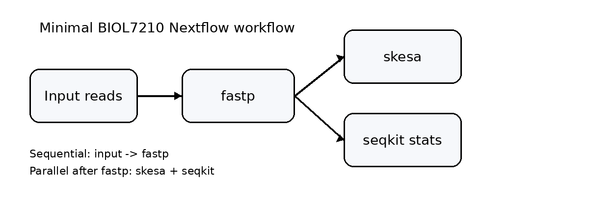

# read-clean-asm_wf

A minimal **Nextflow DSL2** workflow submitted for consideration by Dr. Chris Gulvik for te **BIOL7210** workflow lab.

- **Sequential:** `local paired-end FASTQ reads -> fastp`
- **Parallel after fastp:** `skesa` and `seqkit`

This repo is intentionally simple so it is easy to explain and run.

---

## Workflow diagram



---

## What the pipeline does

1. Reads paired-end FASTQ files listed in `assets/test_samplesheet.csv`
2. **Clean reads** with `fastp`
3. From the cleaned reads, run two jobs **in parallel**
   - **Assemble** with `skesa`
   - **Summarize read statistics** with `seqkit stats`

---

## Features

- Includes **sequential processing**: local input FASTQ -> fastp
- Includes **parallel processing**: fastp output is sent to skesa **and** seqkit at the same time
- Runs **locally** by default
- Includes **test data in the repo**

---

## Repo structure

```text
pa-simple-wf/
├── main.nf
├── nextflow.config
├── modules/
│   ├── fastp.nf
│   ├── skesa.nf
│   └── seqkit_stats.nf
├── assets/
│   ├── test_samplesheet.csv
│   └── workflow_diagram.png
├── test_data/
│   ├── SRR28760303_1.fastq.gz
│   └── SRR28760303_2.fastq.gz
├── scripts/
│   └── report_versions.sh
└── README.md
```

---

## Requirements

- **Nextflow version used:** 25.10.4
- **Package manager and version:** Docker 29.2.1 
- **OS used:** Darwin
- **Architecture used:** arm64

## Software containers used
- fastp: quay.io/biocontainers/fastp:1.3.2--h43da1c4_0
- skesa: quay.io/biocontainers/skesa:2.5.1--hdcf5f25_0
- seqkit: quay.io/biocontainers/seqkit:2.13.0--he881be0_0

---

## Instructions for running

After Nextflow and Docker are installed, copy/paste these **3 commands**:

```bash
git clone https://github.com/karthik-krishnan-28/read-clean-asm_wf.git
cd read-clean-asm_wf
nextflow run main.nf -profile docker
```

This uses the sample paired-end reads in `test_data/` through `assets/test_samplesheet.csv`.

---

## Input files

To run this pipeline on your own paired-end reads, place paired-end FASTQ files in `test_data/` and list them in `assets/test_samplesheet.csv`.

Example:

```csv
sample,r1,r2
PA01,test_data/PA01_R1.fastq.gz,test_data/PA01_R2.fastq.gz
PA02,test_data/PA02_R1.fastq.gz,test_data/PA02_R2.fastq.gz
```

Current test example in this repo:
```csv
sample,r1,r2
PA01,test_data/SRR28760303_1.fastq.gz,test_data/SRR28760303_2.fastq.gz
```

## Expected outputs

Inside `results/`:

- `02_fastp/`
  - cleaned FASTQ files
  - fastp HTML report
  - fastp JSON report
- `03_skesa/`
  - assembled FASTA
- `04_seqkit/`
  - read stats text file
- automatic Nextflow run files:
  - `pipeline_trace.txt`
  - `pipeline_report.html`
  - `pipeline_timeline.html`
  - `pipeline_dag.html`

